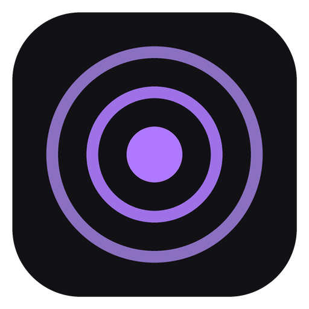

<div align="center">

  

# Glance (MVP)

**Understand any complex paragraph, weird code snippet, or error message before your coffee gets cold.**

_Highlight obscure jargon, AI code, or error logs, press `Cmd+Shift+S`, copy, and get an instant ELI5 explanation or TL;DR summary right from your system tray._

[](https://apple.com)
[](#)
[](#)
[](https://tauri.app)
[](https://svelte.dev)
[](https://www.rust-lang.org)
[](LICENSE)

</div>

---

### _"The best code explanation is the one you never had to leave your IDE or browser to read."_

**Glance** is a hyper-lightweight native desktop tool built with **Tauri + Rust + Svelte**. It sits silently in your macOS menu bar until you hit `Cmd+Shift+S`. Once opened, simply copy (`Cmd+C`) any text on your screen, and Glance will instantly analyze it using ultra-fast LLMs (Groq / Llama 3.1) and pop up a crisp, clutter-free explanation or summary anchored under your menu bar icon.

No context switching. No opening ChatGPT tabs. No $20/month subscription traps.

---

### What Glance is (and isn't)

- **What it is**: A 1-second contextual brain. Open Glance, copy any confusing sentence, math formula, AI-generated code, or error log, get a clear ELI5 answer or TL;DR summary, ask follow-up questions, and keep working.
- **What it isn't**: A 20-page essay generator or a heavy research suite.

> _If you want a 10-paragraph thesis, open ChatGPT. If you want to understand 1 confusing paragraph or error in 2 seconds without breaking your flow, use Glance._

---

## Demo

<div align="center">
  <!-- Replace link with your uploaded MP4 video or GIF -->
  
</div>

---

## OS Platform Availability

Glance is currently focused on delivering a native experience on **macOS**. Cross-platform support for Windows and Linux is currently under active development.

| Operating System | Support Status | Details |
| :--- | :--- | :--- |
| **macOS** (Apple Silicon / Intel) | **Supported** | Native menu bar tray anchoring, macOS vibrancy, global shortcut (`Cmd+Shift+S`). |
| **Windows** | **Coming Soon** | Taskbar system tray anchoring in development. |
| **Linux** | **Coming Soon** | Desktop environment tray integration in development. |

---

## Use Cases

Why waste mental bandwidth decoding dense text or complex code? **Glance** handles:

- **Confusing Paragraphs & Unclear Context**: Highlight dense text, obscure prose, or ambiguous paragraphs to get an instant, clear explanation.
- **Code & Syntax Breakdown**: Highlight complex functions, minified code, regex patterns, or AI snippets to understand what they actually do.
- **Error Logs & Stack Traces**: Highlight compiler errors, build failures, or stack traces for an instant root-cause explanation and fix.
- **Math & Science Calculations**: Solves complex math equations step-by-step accurately with LaTeX rendering (`$...$` and `$$...$$`).
- **Academic & Whitepapers**: Translate complex formulas, dense abstracts, or IEEE math into plain English.
- **Long Articles & Docs Summarization**: Switch to **Summary Mode** for an instant TL;DR of wordy paragraphs or documentation.
- **Legal Fine Print & Terms**: Decode sneaky clauses in Privacy Policies or SaaS contracts without reading 15 pages.

---

## Features

- **Dual AI Modes (`Explain` & `Summary`)**: Seamlessly switch AI focus from the header title dropdown menu (`Glance - Explain` / `Glance - Summary`):
  - **Explain Mode (Default)**: Optimized for unpacking complex code snippets, math formulas, compiler errors, technical jargon, or any confusing paragraph and unclear context that you do not understand. Delivers a clear, easy-to-digest ELI5 explanation of *why* and *how* something works.
  - **Summary Mode**: Optimized for long paragraphs, dense whitepapers, wordy articles, or heavy documentation. Delivers a sharp **TL;DR** section followed by 3 to 5 scannable **Key Takeaways** with bold keywords, stripping away filler words.
- **Active-Window Gated Copy**: Clipboard changes are ONLY processed when Glance is actively open. Copying text while Glance is closed does zero background processing and costs zero API tokens.
- **Near-Zero Footprint**: Native Rust app using minimal RAM. The webview is destroyed when closed—zero background memory drain.
- **Tray-Anchored Popup**: Appears seamlessly under your macOS menu bar tray icon.
- **Rich Markdown & LaTeX Rendering**: Full support for bold/italic typography, inline code blocks, formatted lists, and LaTeX math formulas (`$...$` and `$$...$$` rendered via KaTeX).
- **Multi-Turn Roomchat Session**: Ask follow-up questions or paste multiple snippets into the same roomchat without creating duplicate history entries.
- **Keyboard-First Design**: Press `Esc` to close, `Cmd+C` to copy text.

---

## How to Use

### 1. Clipboard Mode (Text, Modes & Follow-up)

1. **Open Glance (`Cmd+Shift+S`)**: Press `Cmd+Shift+S` or click the Glance tray icon. The Glance popup window will open cleanly without sending old clipboard data to AI.
2. **Select Mode (Optional)**: Click **`Glance - Explain`** in the header to open the dropdown menu and switch to **`Summary Mode`** if you are reading long text.
3. **Highlight & Copy (`Cmd+C`)**: Select any confusing text, code snippet, math formula, or error message anywhere on your screen (Browser, IDE, PDF, Terminal, Slack) and press **`Cmd+C`**.
4. **Auto AI Analysis & Follow-Up**: Glance automatically detects the new copy event while open, streams a clear ELI5 explanation or TL;DR summary, and lets you type follow-up questions in the input box at the bottom.
5. **New Chat (`+`)**: Click the **`+` (Plus)** button in the header to start a fresh roomchat at any time.
6. **Dismiss (`Esc`)**: Press **`Esc`** (or click away) to close the window.

### 2. Vision Mode (Drag & Select Screenshot) — _In Development_

1. Press **`Cmd+Shift+S`**.
2. **Drag & Select**: Drag a box around any chart, diagram, code block, or untranslatable image on your screen.
3. **Instant Analysis**: Gemini Vision analyzes the selected region and gives you an immediate breakdown.

---

## Behind the Scenes & Performance Proof

Glance is engineered to be invisible to system resources. Here is the exact breakdown of how data and memory are handled:

### Where is Chat History Stored?

Glance is 100% local-first and privacy-respecting. All session histories are stored in a clean JSON format via `@tauri-apps/plugin-store` in your OS application data folder:

| Operating System | Storage Path | Status |
| :--- | :--- | :--- |
| **macOS** | `~/Library/Application Support/id.glance/history.json` | Active |
| **Windows** | `%APPDATA%\id.glance\history.json` | Coming Soon |
| **Linux** | `~/.config/id.glance/history.json` | Coming Soon |

### Smart Memory & Token Safeguards

Glance is built with proactive safeguards to keep system usage lightweight and efficient:

- **Disk Protection (~100 KB Cap)**: Automatically caps stored history to 20 sessions, keeping total disk storage under 0.1 MB.
- **RAM Optimization (~0.2 MB Text Heap)**: Minimal memory footprint (~30–50 MB total app process), 1,000x lighter than keeping a browser tab open.
- **Token Overflow Prevention (Sliding Window)**: Automatically caps API context to the 10 most recent messages, preventing token waste and context length errors during long conversations.

---

## Architecture & Tech Stack

```
 ┌───────────────────────────────────────────────────────────┐
 │               Global Shortcut / System Tray               │
 └─────────────────────────────┬─────────────────────────────┘
                               │ (Cmd + Shift + S)
                               ▼
 ┌───────────────────────────────────────────────────────────┐
 │                     Tauri Rust Core                       │
 │  • System Tray Anchored Position                          │
 │  • Gated Clipboard Listener                               │
 │  • Native macOS Window Lifecycle                          │
 └─────────────────────────────┬─────────────────────────────┘
                               │ (IPC Bridge)
                               ▼
 ┌───────────────────────────────────────────────────────────┐
 │                 Minimalist Svelte 5 UI                    │
 │  • 120Hz Smooth Spring Animations                         │
 │  • Dual Mode Switcher (Explain / Summary)                 │
 │  • Marked.js Markdown + KaTeX Math Rendering              │
 │  • Local Storage Store (history.json)                     │
 └─────────────────────────────┬─────────────────────────────┘
                               │ (HTTPS API)
                               ▼
 ┌───────────────────────────────────────────────────────────┐
 │                    Cloud AI Providers                     │
 │  • Groq (Llama 3.1 8B Instant Text Analysis)             │
 │  • Gemini 1.5 Flash (Vision & Screenshot OCR)             │
 └─────────────────────────────┬─────────────────────────────┘
```

| Layer | Technologies & Purpose |
| :--- | :--- |
| **Frontend UI** | **Svelte 5 + Vite** — Reactive UI state, custom HSL design tokens, native spring transitions. |
| **Backend Core** | **Rust + Tauri v2** — Cross-platform system integration, macOS Private API vibrancy & tray anchor. |
| **Typography & Math** | **Marked.js + KaTeX** — GitHub-flavored markdown parsing + LaTeX mathematical rendering. |
| **Local Storage** | **`@tauri-apps/plugin-store`** — Single-file JSON session history (`history.json`). |
| **AI Inference** | **Groq API** (Llama 3.1 8B) for ultra-fast text, **Google Gemini 1.5** for vision. |

---

## Contributing

Contributions are welcome! Feel free to open an issue or submit a pull request.

## License

[MIT](LICENSE) (c) Farhan
